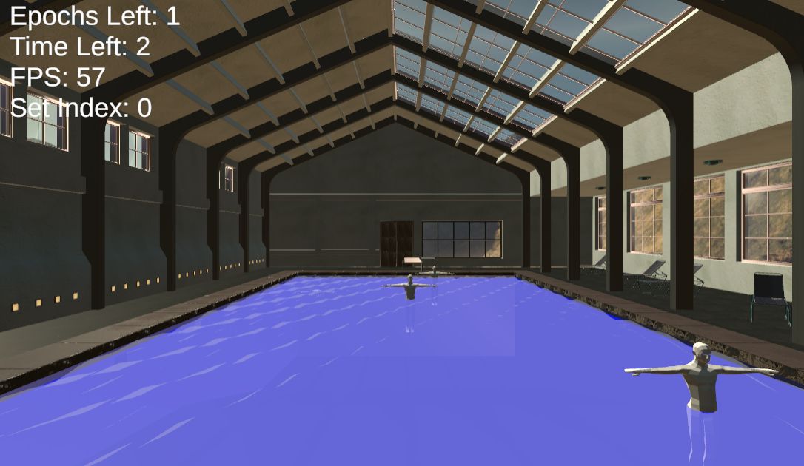

# LifeguardVR
A realtime Unity and C# based lifeguarding simulation virtual reality experiment.

## Features:
-Real time swimmer "epoch" scheduling systems.
-Data capture including player telemetry and virtual reality interactions.
-Detailed swimming pool environment.
-Water simulation vertex shader.

## Compilation:
Use Unity Engine version 2021.3.3f1 to compile this project (tested on Windows with the HTC Vive Pro).

## Project Structure:
Assets/Scenes/start_scene.unity <- Is where the participants's information is taken.
Assets/Scenes/pool_test.unity <- Is where the experiment is run, with the information being logged into a .csv.

## Sample Output:

